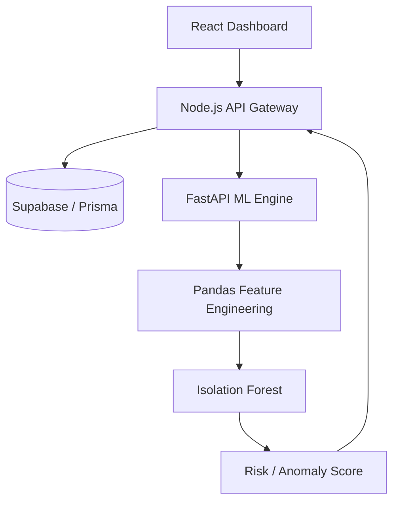
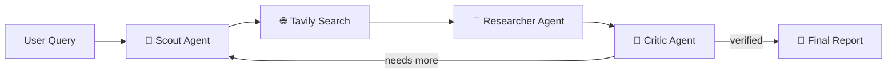

<div align="center">


<a href="https://github.com/keshav62">
  
</a>

<br/>


<br/><br/>

**[About](#-about)** • **[Projects](#-featured-projects)** • **[Tech Stack](#-tech-stack)** • **[Stats](#-github-stats)** • **[Contact](#-lets-connect)**


</div>

## 👨‍💻 About

I'm a **Full Stack Developer from India** who loves building real-world products at the intersection of **software engineering, Machine Learning and Generative AI**. I learn fastest by shipping, and I care about understanding *why* something works, not just making it work.

```js
const keshav = {
  role: "Full Stack Developer",
  focus: ["Generative AI", "LLMs", "RAG", "AI Agents", "Machine Learning"],
  building: ["MPLADS Drishti", "ResearchHive AI", "AI-powered SaaS"],
  learning: ["Next.js App Router", "TypeScript", "System Design", "Docker"],
  motto: "Don't just make it work. Understand why it works.",
};
```

| 💻 Full-Stack Apps | 🤖 GenAI & Agents | 📊 ML & Analytics | ⚡ Real-Time |
| :---: | :---: | :---: | :---: |
| React, Next.js, Node, FastAPI | LangChain, LangGraph, RAG | Pandas, Scikit-learn, Isolation Forest | WebSockets, Socket.io |

<div align="center">

</div>

## 🏆 Featured Projects

<table>
<tr>
<td width="50%" valign="top">

### 🏛️ MPLADS Drishti
**AI project monitoring & risk intelligence** for government development projects: anomaly detection, investigations, RBAC and AI-generated reports.

`React` `Node.js` `FastAPI` `Scikit-learn` `Supabase` `Prisma`

[Repository](https://github.com/keshav62/mplads_ai) • [SIH2026](https://github.com/keshav62/SIH2026_techhustlers)

</td>
<td width="50%" valign="top">

### 🔬 ResearchHive AI
**Multi-agent research system.** Scout, Researcher and Critic agents search, scrape, verify and write the final report.

`Python` `FastAPI` `LangGraph` `LangChain` `Tavily` `Groq` `React`

[Repository](https://github.com/keshav62/ResearchHive-AI-A-Multi-Agent-Research-System)

</td>
</tr>
<tr>
<td width="50%" valign="top">

### 🎓 CourseMate AI
**RAG study assistant.** Upload PDFs and get answers grounded in your own material, with source references.

`Python` `LangChain` `Gemini` `ChromaDB` `HuggingFace`

[Repository](https://github.com/keshav62/CourseMate-AI-Using-RAG)

</td>
<td width="50%" valign="top">

### 🧠 Intervue AI
**AI interview platform** with mock interviews, system design practice, an AI co-pilot and progress analytics.

`Next.js` `TypeScript` `Gemini` `Prisma` `PostgreSQL` `Stream Video`

[Repository](https://github.com/keshav62/AI-Powered-Interview-Platform-)

</td>
</tr>
</table>

<details>
<summary><b>🏗️ MPLADS Drishti — architecture</b></summary>



**Highlights:** Isolation Forest anomaly detection • investigation management • AI-assisted reports • role-based and data-level security • State / District / Constituency filtering • time-series and financial analytics.

</details>

<details>
<summary><b>🤖 ResearchHive AI — agent workflow</b></summary>



**Highlights:** specialised agents instead of one do-everything model • web search and scraping • source collection • automated, quality-checked reports.

</details>

### 🚀 More Projects

<details>
<summary><b>AI &amp; SaaS</b></summary>
<br/>

| Project | What it does | Stack | Link |
| :-- | :-- | :-- | :-: |
| 🤖 **MindGPT** | AI chat + image generation SaaS with Stripe credits, voice-to-text, chat sessions and community gallery | React, Node, MongoDB, Gemini, ImageKit, Stripe | [Repo](https://github.com/keshav62/-MindGPT---AI-Chat-Image-Generator-SaaS-MERN-Gemini-Stripe-) |
| 🎨 **Text-to-Image SaaS** | Prompt-to-image generator with credits, pricing plans and downloads | React, Node, MongoDB, Clipdrop API | [Repo](https://github.com/keshav62/AI-Text-to-Image-Generator-SaaS-) |
| 🏙️ **City Intelligence Agent** | Tool-using agent for live weather, news and web search about any city | Python, LangChain, Gemini, Tavily | [Repo](https://github.com/keshav62/City-Intelligence-Agent) |

</details>

<details>
<summary><b>Full-stack platforms</b></summary>
<br/>

| Project | What it does | Stack | Link |
| :-- | :-- | :-- | :-: |
| 🏛️ **CivicConnect** | Civic issue reporter with GPS, maps, heatmaps and citizen / admin / field-worker roles | React, Node, Express, Maps | [Repo](https://github.com/keshav62/Pothole-Civic-Issue-Reporter-with-Map-View) |
| 📚 **LibraFlow** | Library management and digital catalog | Next.js 16, React 19, TS, Clerk, Prisma | [Repo](https://github.com/keshav62/Library-Management-System) |
| 🎓 **Learning Management System** | Courses, video lectures, progress tracking, Stripe payments | React, Node, MongoDB, Clerk, Stripe | [Repo](https://github.com/keshav62/LEARNING-MANAGEMENT-SYSTEM) |
| 💬 **Real-Time Chat** | Instant messaging with typing indicators, read receipts and presence | React, Socket.io, MongoDB, JWT | [Repo](https://github.com/keshav62/RealTime-Chat-Application-) |
| 📦 **Inventory System** | Stock tracking, EOQ calculation, reorder alerts, procurement | Node, MongoDB | [Repo](https://github.com/keshav62/inventory-system) |

</details>

<details>
<summary><b>Learning &amp; experiments</b></summary>
<br/>

[🛒 Amazon Clone](https://github.com/keshav62/Amazon-clone) •
[🎬 Netflix Clone](https://github.com/keshav62/Netflix-clone) •
[📖 Bright Future](https://github.com/keshav62/BRIGHT-FUTURE) •
[🏗️ System Design](https://github.com/keshav62/SYSTEM-DESIGN) •
[💻 Operating System](https://github.com/keshav62/Operating_System) •
[🏆 Hackathon](https://github.com/keshav62/hackathon) •
[🚀 Itzfizz](https://github.com/keshav62/Itzfizz)

</details>

<div align="center">

</div>

## 🛠️ Tech Stack

<div align="center">

**Languages**<br/>


**Frontend**<br/>


**Backend**<br/>


**Databases**<br/>


**AI / ML**<br/>
<br/>


**Auth, Payments & Services**<br/>


**Tools**<br/>


</div>

<div align="center">

</div>

## 🧩 DSA &amp; Problem Solving

**600+ problems solved** across LeetCode and practice sets.

`Arrays & Strings` `Hashing` `Sliding Window` `Two Pointers` `Binary Search` `Prefix Sum` `Linked Lists` `Stack & Queue` `Trees` `Heaps` `Graphs` `BFS / DFS` `Dijkstra` `Topological Sort` `Dynamic Programming` `Segment Trees` `Greedy`

## 🎯 Highlights

- 🏆 Hackathon Winner
- 🤖 Built AI-powered SaaS apps and multi-agent systems
- 📊 Built ML-based risk and anomaly detection
- ⚡ Built real-time apps with WebSockets
- 🚀 Shipped many full-stack applications end to end

## 🌱 Currently Learning

| Area | Focus |
| :-- | :-- |
| 🤖 **GenAI** | Prompt engineering, RAG, agents, tool calling, multi-agent systems |
| ⚛️ **Next.js** | App Router, Server Components, full-stack apps |
| 🔷 **TypeScript** | Advanced types, generics, type-safe architecture |
| 🏗️ **System Design** | Caching, load balancing, distributed systems |
| 🐳 **Docker** | Containers, images, deployment |

<div align="center">

</div>

## 📊 GitHub Stats

<div align="center">

<a href="https://github.com/keshav62">
  
</a>
<a href="https://github.com/keshav62">
  
</a>

<br/><br/>


<br/><br/>


<br/><br/>


<br/><br/>

<picture>
  <source media="(prefers-color-scheme: dark)" srcset="https://raw.githubusercontent.com/keshav62/keshav62/output/github-contribution-grid-snake-dark.svg" />
  <source media="(prefers-color-scheme: light)" srcset="https://raw.githubusercontent.com/keshav62/keshav62/output/github-contribution-grid-snake.svg" />
  
</picture>

</div>

## 🤝 Let's Connect

<div align="center">

<a href="https://github.com/keshav62"></a>
<a href="https://linkedin.com/in/keshav62"></a>
<a href="mailto:keshav62@gmail.com"></a>

<br/><br/>

> *Coffee + Code = Productive Day ☕*

<a href="https://github.com/keshav62">
  
</a>


</div>
